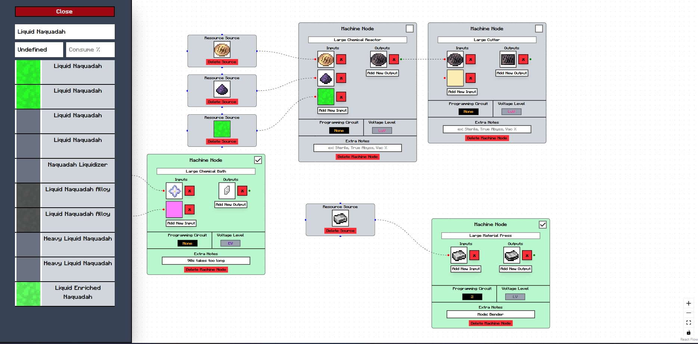

# Documentation guide (what your docs must contain)

Your Documentation Update is graded in week 1 and again in week 2. Documentation
is not an afterthought: a reader who has never seen your project should be able
to understand what it is, get it running, and use it, from your docs alone. Keep
your documentation in your project repository's `README.md` (and link it, or a
copy, from your workspace `project/`).

Your documentation must contain these sections. Aim for clear and complete, not
long.

## 1. Overview

GregTech Process Line Planner is a web application that primarily helps Star Technology Modpack players. With the
majority of Star Technology's ingame assets, users can easily search up the item/liquid names of Minecraft, GregTech and Star Technology 
to create nodes with machine-relevant information


## 2. Setup and installation

- At `server/`, create a `.env` file and create a `URI=` property with your mongodb cluster string uri details as value

## 3. How to run it

### For local testing
- Run `npm i` at `client/` and `server/`
- Run `npm run dev` at `client/` to start client for localhost. localhost link with the correct port should show up in console
- Run `node app.js` at `server/` to start server for localhost. Messages related to successful connection should show up in console.

## 4. Features and usage

- Pressing the `Create New Source Node` creates a node that holds one Ingredient Slot. 
- Ingredient Slots can be clicked to open the left side Material Suggester. Click the same Ingredient Slot to close it. Clicking other Ingredient Slots will update with said slot's data.
- Pressing the `Create New Machine Node` creates a machine node. You can set the machine name, voltage tier, programming circuit and extra notes in it. 
- In a Machine Node, pressing `Add New Input` or `Add New Output` creates one Ingredient Slot for input/output which can also be deleted with their respective Red `X` Button
- You can click on the Blue/Red/Green circles to spawn a line. Blue/Green must be connected to a Red circle to form a line
- Pressing `Get Used Machines` opens a medium sized window that totals machine names across nodes
- Pressing `Import/Export Graphs` opens a small sized window that gives the user the node's string for sharing that can be inputted to the import field.
- Pressing `Publish Graph` opens a small sized window that requires the user to fill in details so it would later be stored in a MongoDB Database
- Pressing `View Published Graphs` sends the user to a page that displays all published graphs where the user can select and load said graph.

## 5. Project structure
```
client                Frontend website built using vite
  public/assets       Holds asset files
    atlas_images      Holds atlas images of minecraft item icons
    data              Holds json files for item ingame name, file name, and atlas data
  src                 Contains code for rendering the website
    assets            Holds other assets
    components        Holds reusable components
    context           Holds react contexts
    enums             Holds enums
    functions         Holds reusable functions

docs                  Holds documentation

server                Backend Server
```

## 6. Screenshots



## 7. Known issues and next steps

- You currently cannot open the graph browser for the button is still nonfunctional
- MongoDB cluster data is still not connected to the graph browser