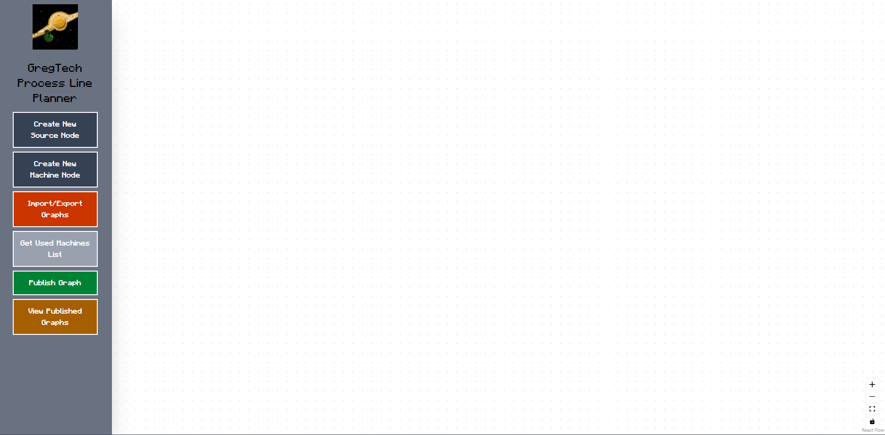

[](AI-USAGE.md)

# GregTech Process Line Planner

**Live site:** https://gregtech-process-line-planner-website.onrender.com  
**API:** https://gregtech-process-line-planner.onrender.com  
**Demo video:** (link)



## What it does

- Helps users plan out their process lines in GregTech (more suitable for Star Technology Modpack players) by creating source nodes and machine nodes
- Helps users write the ingame name of materials by having access to a copy of local name of Minecraft, Star Technology Core, KubeJS and GregTech items loaded in Star Technology Modpack
- Import graphs made by others and Export graphs made by you for sharing
- Provides a graph browser for browsing publicly published graphs for easy import for use.

## Built with

- React Vite : FrontEnd
- ExpressJS : Backend
- Supabase PostgreSQL : Database 

## Running it yourself         

**The whole stack.** 

    # 1. the database

    Table Schema:
    
    create table public.published_graphs (
        id serial not null,
        author text not null default 'Anonymous'::text,
        graph_name text not null default ''::text,
        graph_description text not null default ''::text,
        graph_string_data text not null default ''::text,
        constraint users_pkey primary key (id)
    ) TABLESPACE pg_default;

    # 2. the API (Website can still work without it, but the publish graph and browse page will be disabled)
    - cd server
    - npm install
    - cp .env.example .env        # check DATABASE_URL
    - # Fill in supabase details at .env
    - npm run start

    # 3. the client, in another terminal
    - cd client
    - npm install
    - cp .env.example .env
    - # set API_URL to the url of your backend
    - npm run dev

Check the API on its own before you blame the client:

    curl http://localhost:3000/                      # is the process alive
    curl http://localhost:3000/published_graphs      # returns table contents

## Environment variables

### Server
```
SUPABASE_URL=
SUPABASE_PUBLISHABLE_KEY=
SUPABASE_SECRET_KEY=
SUPABASE_JWKS_URL=

CORS_ORIGIN= (static website url)
```

### Client
```
VITE_API_URL= (backend api url)
```

## Deploying

**Client, to GitHub Pages.** Already wired up in
`.github/workflows/deploy-pages.yml`. Two one-time steps:

1. **Settings > Pages > Build and deployment > Source: GitHub Actions.** Without
   this the workflow goes green and publishes nothing.
2. Nothing else, until your API is live. Demo mode is the default, so the first
   deploy works on its own. When the API is up, add `VITE_USE_MOCK_API` = `false`
   and `VITE_API_BASE_URL` under **Settings > Secrets and variables > Actions >
   Variables**, then re-run the workflow.

The repository must be **public** for Pages to serve it on a free account.

**API and database.** Not automated here, because most hosts deploy straight from
your repository with no workflow at all. Point your host at the `server/` folder,
set the environment variables in its dashboard, and run `server/db/schema.sql`
once against the hosted database.

## Project Structure

### Client
```
/ : Base files including the .env file
/dist : Compiled version of the website
/public/assets : Contains assets and data including json files and webp 
/src : Holds the project's code
/src/assets : Holds assets that are more needed in the code via imports
/src/components : Holds reusable react components
/src/contexts : Holds react context providers
/src/enums : Holds the project's enum values
/src/functions : Holds the project's reusable functions
/src/types : Holds the project's unique types
```

### Server
```
app.js : The main file of the backend server
.env : Holds the supabase details needed to successfully connect to the database
package.json : Holds the library/dependency details  
```

## Architecture

### Client
```text
╔══════════════════════════════════════════════════════════════════════════════════════╗
║                              CLIENT ARCHITECTURE                                     ║
╠══════════════════════════════════════════════════════════════════════════════════════╣
║  Browser entry → Main.tsx                                                            ║
║      │                                                                               ║
║      ├─ HashRouter                                                                   ║
║      ├─ ClientViewHandlerContextProvider                                             ║
║      ├─ ReactFlowProvider                                                            ║
║      ├─ GraphDataContextProvider                                                     ║
║      ├─ MaterialSuggesterDataProvider                                                ║
║      └─ AssetDataContextProvider                                                     ║
║          │                                                                           ║
║          ├─ /  → GraphRenderer.tsx                                                   ║
║          └─ /published-graphs → PublishedGraphsBrowser.tsx                           ║
║                                                                                      ║
║  ┌────────────────────────────────┐  ┌──────────────────────────────────────┐        ║
║  │ Graph editor / UI shell        │  │ Supporting data & state              │        ║
║  │ • GraphRenderer.tsx            │  │ • GraphDataContext.tsx               │        ║
║  │ • SourceNode / MachineNode     │  │ • AssetDataContext.tsx               │        ║
║  │ • LeftSideViewManager          │  │ • MaterialSuggesterDataContext.tsx   │        ║
║  │ • PublishGraphMenu             │  │ • ClientViewHandlerContext.tsx       │        ║
║  └────────────────────────────────┘  └──────────────────────────────────────┘        ║
║                  │                                                                   ║
║                  ├─ node logic / graph actions                                       ║
║                  │                                                                   ║
║  ┌───────────────┴─────────────────┐  ┌──────────────────────────────────────┐       ║
║  │ components/                     │  │ functions/                           │       ║
║  │ • nodes/                        │  │ • addMachineNode.tsx                 │       ║
║  │ • machine_node_components/      │  │ • addSourceNode.tsx                  │       ║
║  │ • leftside_viewmanager/         │  │ • resolveCollisions.tsx              │       ║
║  │ • ImportExportDisplay.tsx       │  │ • handleGraphImport.tsx              │       ║
║  │ • UsedMachinesListDisplay.tsx   │  │ • handleGraphExport.tsx              │       ║
║  └─────────────────────────────────┘  └──────────────────────────────────────┘       ║
║                                                                                      ║
║  Data / assets                                                                       ║
║  ┌──────────────────────────────────────────────────────────────────────────────┐    ║
║  │ public/assets/data/*.json • atlas.json • emi_categories.json                 │    ║
║  │ img_to_name_pairs.json • sprite assets • local Minecraft/GregTech data       │    ║
║  └──────────────────────────────────────────────────────────────────────────────┘    ║
╚══════════════════════════════════════════════════════════════════════════════════════╝
```

## Author

- Josef Miko G. Urquico

## Licence

MIT, see [LICENSE](LICENSE).
